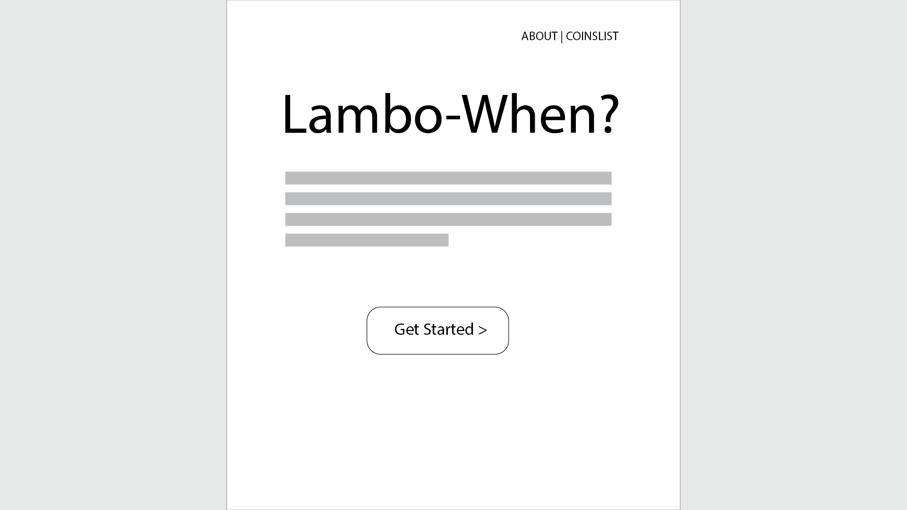
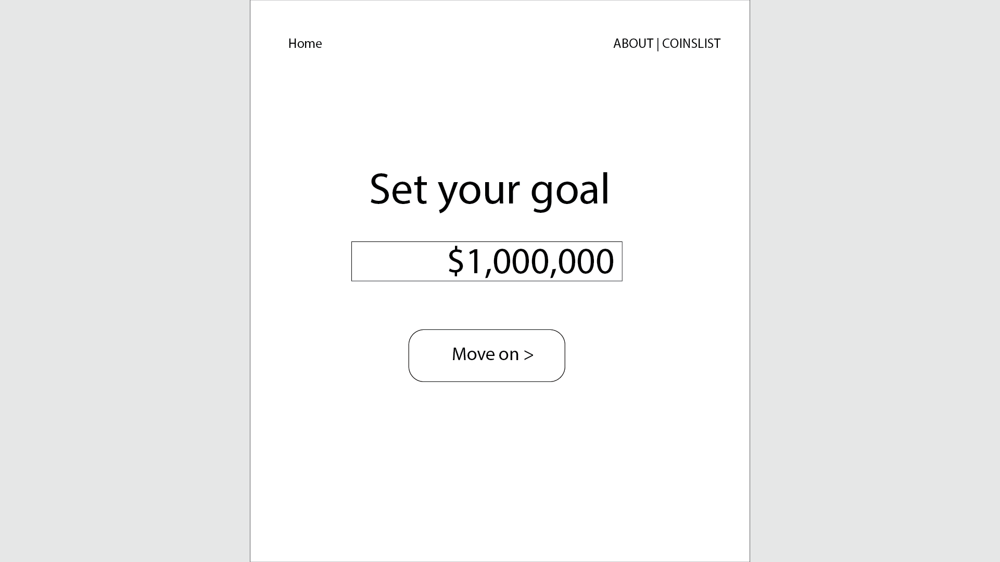
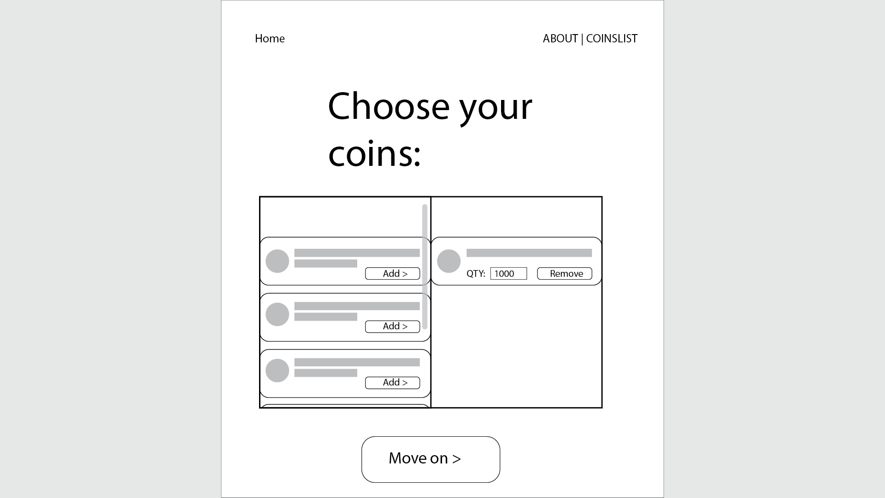
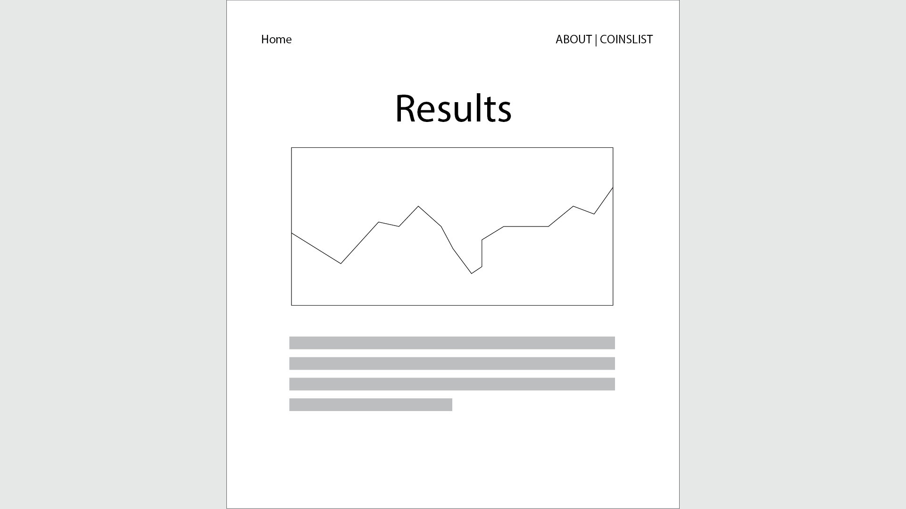

# LamboWhen
An app for accessing data related to your crypto portfolio goals

## Proposal
I want to develop an app that leverages [Coinranking API](https://developers.coinranking.com/api) to display information about the investments of users.

At a bare minimum the app should:

1. Allow a user to submit a goal value for their portfolio.

2. Allow the user to select the coins they currently own from a list of coins rendered from the API call.

3. Allow users to select how much of each coin they currently own.

4. Evaluate the current price of the portfolio to determine relevant data including how much their portfolio would need to increase to meet their goal, the current price and recent performance of each coin in their portfolio, and the recent performance of their portfolio as a whole. 

### User Stories
"I want to see how all my crypto investments are performing in one place."

"I want to determine how far away I am from my target ROI value."

"I want to simple dashboard that displays only the projects I'm invested in without data from a bunch of other chains."

## How to get started
My first concern, of course, is ensuring that I can reliably pull the data I need in order to deliver the results a user expects. Luckily, as far as I can tell, my API calls seem to be returning the information I need for funcitonality. Namely, price and recently performance in a sparkline array.

Below is an example response that I cut a bit short to include only one out of the fifty coins in the object.

```
{
	"status": "success",
	"data": {
		"stats": {
			"total": 21448,
			"totalCoins": 21448,
			"totalMarkets": 30181,
			"totalExchanges": 164,
			"totalMarketCap": "1043375050771",
			"total24hVolume": "63200203190"
		},
		"coins": [
			{
				"uuid": "Qwsogvtv82FCd",
				"symbol": "BTC",
				"name": "Bitcoin",
				"color": "#f7931A",
				"iconUrl": "https://cdn.coinranking.com/bOabBYkcX/bitcoin_btc.svg",
				"marketCap": "392811666830",
				"price": "20463.351259238676",
				"listedAt": 1330214400,
				"tier": 1,
				"change": "-0.05",
				"rank": 1,
				"sparkline": [
					"20469.420687605212",
					"20491.806225057648",
					"20523.091275997962",
					"20499.390885271492",
					"20462.096672009564",
					"20518.300099146647",
					"20593.513354720006",
					"20594.120224546412",
					"20576.30054198587",
					"20579.620085121",
					"20624.616334758197",
					"20586.40448194229",
					"20568.611621050495",
					"20496.85580533492",
					"20451.091930369013",
					"20439.442896950884",
					"20469.430026175873",
					"20446.27052466074",
					"20417.397432534875",
					"20456.95827045399",
					"20455.466716769388",
					"20481.07804586518",
					"20465.824534122017",
					"20469.92012352856",
					"20463.35504333631"
				]
			}
		]
	}
}
```

After a successful connection is made, the next priority will be determining what information we want to display and writing the logic to manipulate and return data in response to user input. 

## TRELLO BOARD

My Trello board for this project can be [found here](https://trello.com/b/AOKz1Nkf/lambowhen).

## WIREFRAMES

Below I've included initial concepting (subject to change).





### With component mapping

TBD

## Component frameworks I intend to use

[React Sparklines](https://github.com/borisyankov/react-sparklines) enables easy svg rendering of sparklines from an array of data points. 

