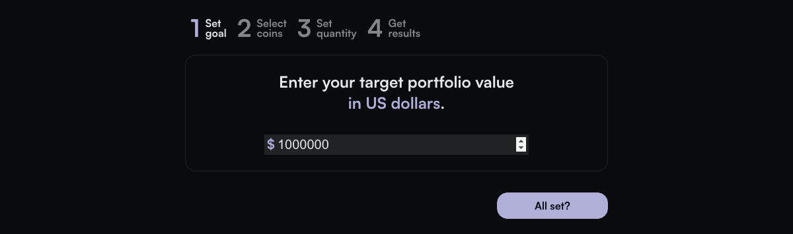
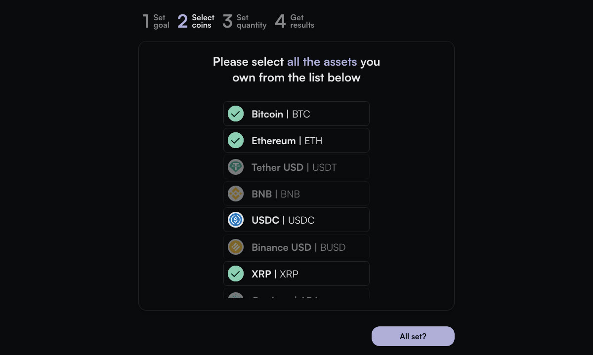
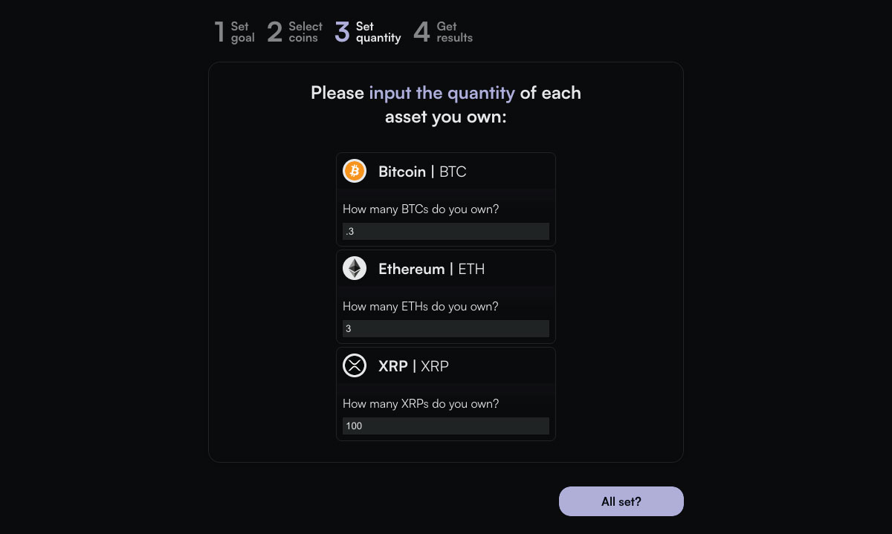
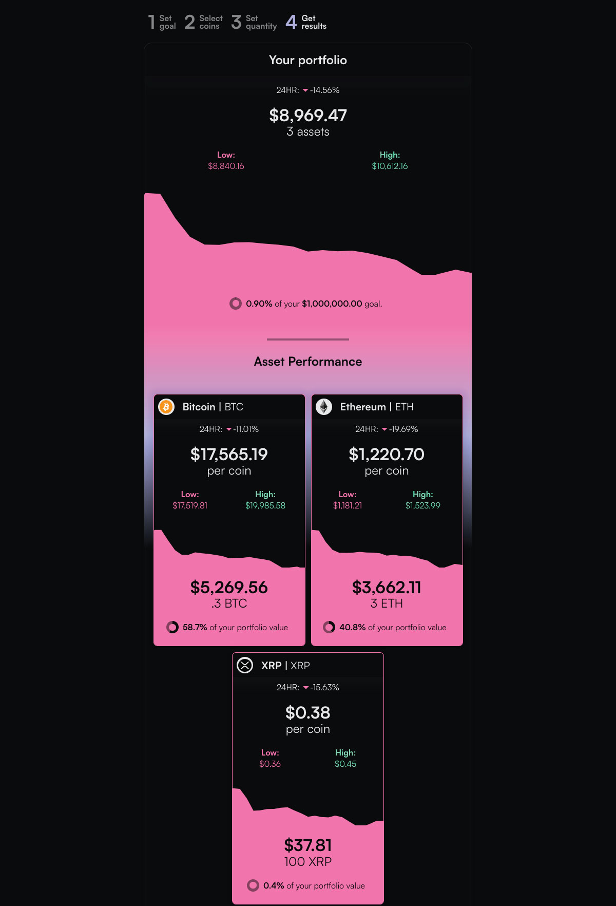

# LamboWhen
An app for accessing data related to your crypto portfolio goals

## About
LamboWhen? is an app that leverages [Coinranking API](https://developers.coinranking.com/api) to display information about the investments of crypto holder and can be found [deployed on netlify](https://lambowhen.netlify.app/).

It works by receiving data from the API which returns an array of the top 50 crypto projects by market cap in addition to receiving user input. 

Example API response below:

```
{
	"status": "success",
	"data": {
		"stats": {
			"total": 21448,
			"totalCoins": 21448,
			"totalMarkets": 30181,
			"totalExchanges": 164,
			"totalMarketCap": "1043375050771",
			"total24hVolume": "63200203190"
		},
		"coins": [
			{
				"uuid": "Qwsogvtv82FCd",
				"symbol": "BTC",
				"name": "Bitcoin",
				"color": "#f7931A",
				"iconUrl": "https://cdn.coinranking.com/bOabBYkcX/bitcoin_btc.svg",
				"marketCap": "392811666830",
				"price": "20463.351259238676",
				"listedAt": 1330214400,
				"tier": 1,
				"change": "-0.05",
				"rank": 1,
				"sparkline": [
					"20469.420687605212",
					"20491.806225057648",
					"20523.091275997962",
					"20499.390885271492",
					"20462.096672009564",
					"20518.300099146647",
					"20593.513354720006",
					"20594.120224546412",
					"20576.30054198587",
					"20579.620085121",
					"20624.616334758197",
					"20586.40448194229",
					"20568.611621050495",
					"20496.85580533492",
					"20451.091930369013",
					"20439.442896950884",
					"20469.430026175873",
					"20446.27052466074",
					"20417.397432534875",
					"20456.95827045399",
					"20455.466716769388",
					"20481.07804586518",
					"20465.824534122017",
					"20469.92012352856",
					"20463.35504333631"
				]
			}
		]
	}
}
```

### Relevant API data

Each array item is an object that includes the following relevant data:

1. Coin name, symbol, and icon.

2. Coin price at time of API call.

3. Coin performance over a 24 hour period.

### Relevant user input

The user inputs the following data:

1. A target portfolio value in USD.

2. The crypto assets they're currently holding (from the returned array).

3. The quantity of each crypto they're currently holding.

### How API data and user input work together

The app basically revolves around the following states:

```
  const [portfolio, setPortfolio] = useState({
    goal: 0,
    value: 0,
    sparkline: new Array(25).fill(0, 0, 25),
  });
  const [coins, setCoins] = useState([]);
```

The portfolio state is initialized with no goal, no value, and an array filled with 25 zeros. All of which is updated based on user input.

The coins state is initialized as an empty array but is set when the API response is mapped to return each object's spread properties in addition to new properties, for better or worse. Upon later consideration I realize this makes the app less dynamic and more error-prone so this will have to be updated. That being said, it currently looks something like this:

```
APIresponse = response.data.data.coins;
  setCoins(
    APIresponse.map((coin) => {
      return {
        ...coin,
        selected: false,
        qty: 0,
        holdingsValue: 0,
        holdingsSparkline: [],
      };
 })
 ```

 As the user makes their way through the steps of inputting information these states update to reflect the amount of each asset owned. This information is then used to determine the total portfolio value and performance, in addition to the value of the shares the user holds. 


### The process

#### Setting a goal



#### Selecting coins



#### Setting quantity


#### View results


## Cloning and/or contributing

To tinker with the code yourself you can follow these steps:

1. Fork this repo to your own and clone it down to your computer.

2. Run 'npm i' to install all necessary packages and

3. Generate an Coinranking API key on RapidAPI and save it in an .env file on the root directory of the react app. Name it `REACT_APP_COINRANKING_KEY`.

4. Run `npm start` to start a local server.

5. Update code as necessary/as you desire. If you'd like to make a pull request then commit with a detailed message after each change. Requests with multiple nontrivial changes or without detailed commit messages will be rejected without review. 

The app should run in your

## Component frameworks used

[React Sparklines](https://github.com/borisyankov/react-sparklines) enables easy svg rendering of sparklines from an array of data points. 

